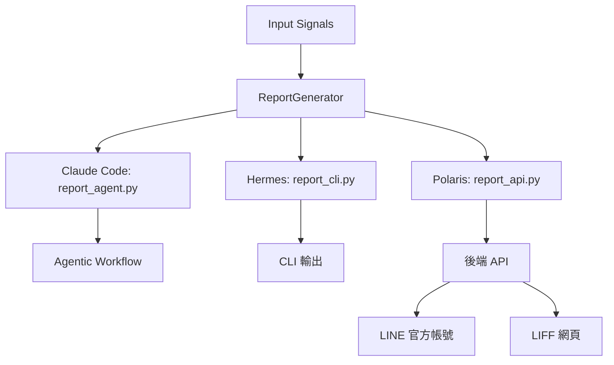

# AlphaEar Reporter Skill 統一設計規格

## 1. 概述

本設計旨在讓 `alphaear-reporter` skill 同時滿足三種使用場景：
- **Claude Code**：互動式 Agentic Workflow
- **Hermes Agent**：非互動式 CLI 呼叫
- **Polaris 前端**：Python import → 後端 API → 前端（LINE 官方帳號 + LIFF）

透過核心邏輯抽象化 + 多進入點設計，實現程式碼重用與場景最佳化。

## 2. 設計目標

| 目標 | 解決方案 |
|------|----------|
| **相容性** | 抽象 `ReportGenerator` 核心邏輯，支援三種場景 |
| **標準化** | 統一輸出格式（JSON + Markdown + LINE 友好） |
| **擴展性** | 抽象 `LLMClient` 介面，允許外部注入 LLM 後端 |
| **Humanize-ZH** | 統一由 `ReportGenerator` 處理格式檢查 |

## 3. 架構設計



## 4. 核心元件

### 4.1 ReportGenerator

**檔案**：`scripts/report_generator.py`

**職責**：
- 抽象現有 Agentic Workflow（Cluster → Write → Assemble）
- 支援 LLM 驅動與簡化邏輯（`use_llm` 參數）
- 輸出標準化格式（Markdown/JSON/LINE 友好）

**關鍵方法**：
```python
async def generate_report(
    self,
    signals: List[Dict[str, Any]],
    market: MarketType = "tw",
    language: str = "zh-TW",
    use_llm: bool = True,
) -> Dict[str, Any]
```

### 4.2 LLMClient 抽象介面

**檔案**：`scripts/utils/llm/base_client.py`

**介面定義**：
```python
class LLMClient(ABC):
    @abstractmethod
    async def generate(
        self,
        prompt: str,
        json_mode: bool = False,
        temperature: float = 0.7,
        max_tokens: int = 4096,
    ) -> str
```

**預設實作**：`scripts/utils/llm/default_client.py`（相容現有 `LLMRouter`）

### 4.3 進入點

| 進入點 | 檔案 | 呼叫方式 | 使用場景 |
|--------|------|----------|----------|
| Agentic Workflow | `report_agent.py` | Python import | Claude Code |
| CLI 介面 | `report_cli.py` | `python -m report_cli --signals '...'` | Hermes Agent |
| Python API | `report_api.py` | `ReportAPI.generate_report_for_line()` | Polaris 後端 |

## 5. 輸出格式

### 5.1 標準輸出結構

```json
{
  "markdown": "# 研報\n\n## 摘要\n- 近期股價上漲 3.45%...",
  "json": {
    "title": "研報",
    "summary_bullets": ["近期股價上漲 3.45%"],
    "sections": [{"title": "詳細分析", "content": "..."}]
  },
  "line_friendly": "【研報】\n\n▌摘要\n• 近期股價上漲 3.45%..."
}
```

### 5.2 LINE 官方帳號格式規則

| 原始 Markdown | LINE 友好格式 |
|----------------|---------------|
| `# 主標題` | `【主標題】` |
| `## 節標題` | `▌節標題` |
| `- 項目` | `• 項目` |
| `json-chart` 區塊 | 忽略 |

### 5.3 LIFF 網頁格式

```html
<!DOCTYPE html>
<html>
<body>
  <h1>研報</h1>
  <h2>摘要</h2>
  <ul><li>近期股價上漲 3.45%</li></ul>
  <div class="json-chart">...</div>
</body>
</html>
```

## 6. 相容性設計

### 6.1 Claude Code

- 保留現有 `report_agent.py`，直接呼叫 `ReportGenerator`
- 互動式流程不變，但底層邏輯統一

### 6.2 Hermes Agent

- 透過 CLI 呼叫 `report_cli.py`
- 支援 `--no-llm` 模式（簡化邏輯）
- 輸出格式：Markdown/JSON/LINE 友好

### 6.3 Polaris 前端

- 後端 import `ReportAPI`
- 支援 LINE 官方帳號（純文字）與 LIFF（HTML）
- 可選注入 LLM client 或使用簡化邏輯

## 7. 測試策略

### 7.1 單元測試

- **無 LLM 模式**：驗證簡化邏輯正確性
- **輸出格式**：驗證 Markdown/JSON/LINE 友好格式轉換
- **市場相容性**：驗證 `tw`/`us`/`both` 市場設定

### 7.2 整合測試

| 場景 | 測試方法 |
|------|----------|
| Claude Code | 互動式測試 Agentic Workflow |
| Hermes Agent | CLI 呼叫驗證輸出格式 |
| Polaris 後端 | Python import 驗證 LINE/LIFF 輸出 |

## 8. 實作計劃

1. **核心邏輯抽象化**：實作 `ReportGenerator`
2. **LLM 介面抽象**：實作 `LLMClient` 介面與預設實作
3. **進入點實作**：實作 `report_cli.py` 與 `report_api.py`
4. **相容性修改**：修改現有 `report_agent.py` 使用 `ReportGenerator`
5. **測試**：撰寫單元測試與整合測試
6. **文件更新**：更新 `SKILL.md` 與新增 CLI 文件

## 9. 風險與緩解

| 風險 | 緩解措施 |
|------|----------|
| LLM 依賴導致失敗 | 提供 `--no-llm` 簡化邏輯備援 |
| 輸出格式不一致 | 統一由 `ReportGenerator` 處理格式轉換 |
| 多場景相容性複雜 | 抽象核心邏輯，最小化進入點差異 |

## 10. 相依性

- **資料庫**：`DatabaseManager`（現有實作）
- **LLM**：`LLMClient` 抽象介面（允許外部注入）
- **格式轉換**：`ReportUtils`（現有實作）

---
**版本**：1.0.0
**建立日期**：2026-08-04
**作者**：Wolfgang